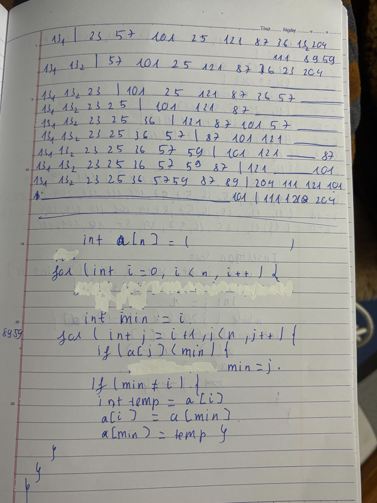
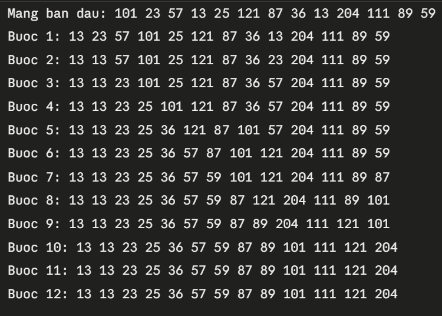
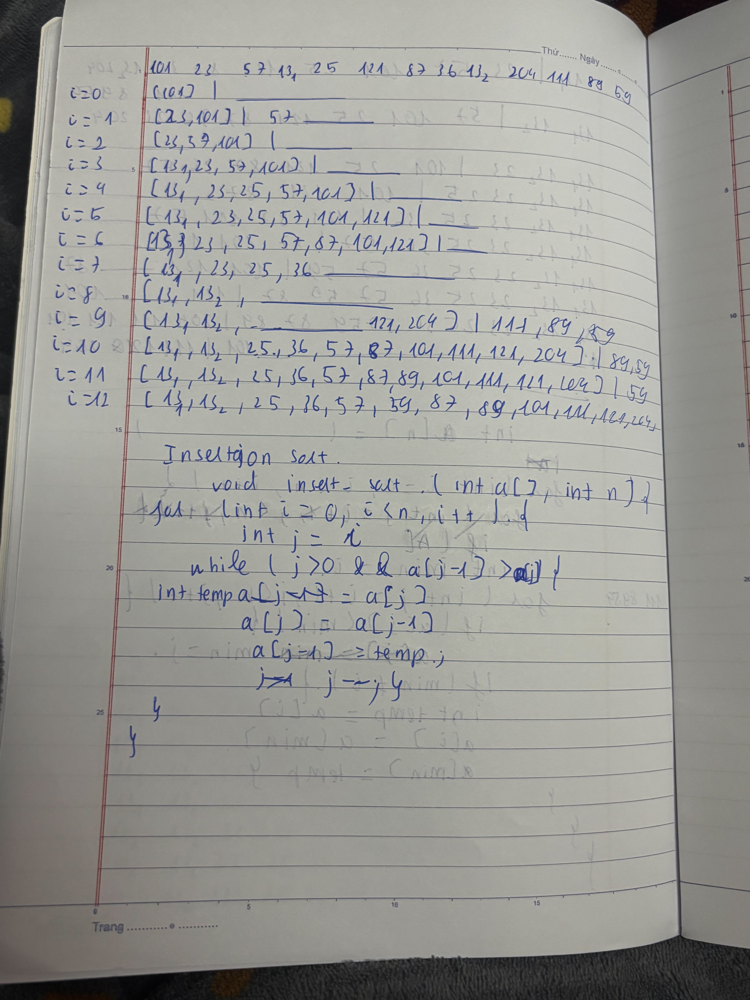
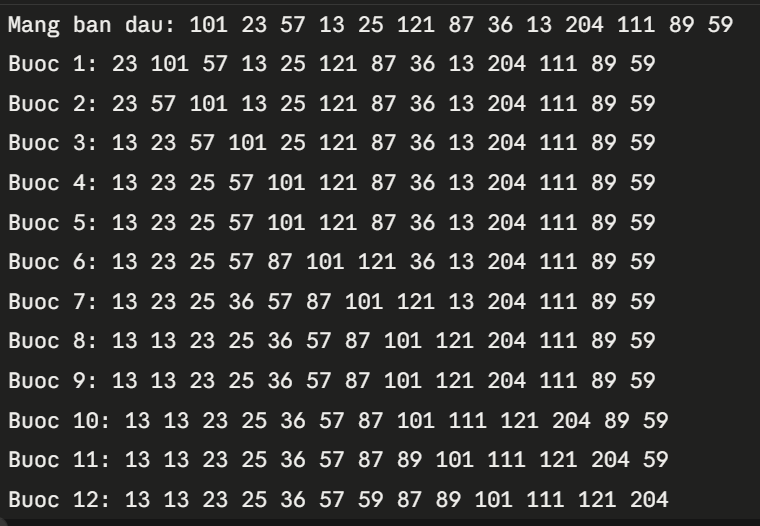

# Bài tập tuần 5 – Sắp xếp chọn (Selection Sort) & Sắp xếp chèn (Insertion Sort)
## 1. Selection Sort (sắp xếp chọn)
- Độ phức tạp: O(n²) về so sánh, tối đa n−1 lần đổi chỗ.
**Bảng viết tay:**

**Kết quả chạy:**

## 2. Insertion Sort (sắp xếp chèn)
- Độ phức tạp: O(n²) trường hợp xấu, O(n) nếu mảng đã gần sắp xếp.

**Bảng viết tay** :

**Kết quả chạy:**

